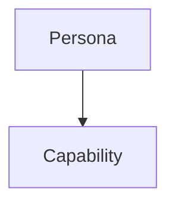
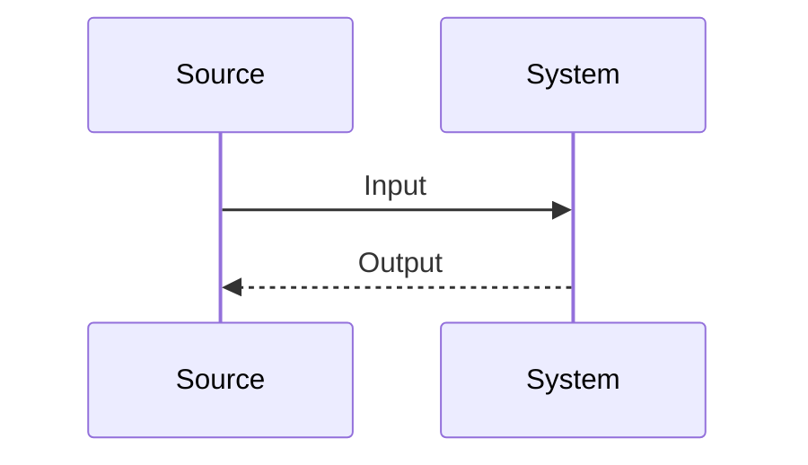

# Documenting Legacy .NET

## Overview

Analyze legacy .NET codebases and produce evidence-backed documentation. Extract what code proves. Mark missing context explicitly. Output in English.

## When to Use

- Legacy C#, VB.NET, or F# code with weak or missing documentation
- Reverse-engineering console apps, APIs, class libraries, background jobs, or mixed solutions
- Requests for functional requirements, entities, entry points, or Mermaid diagrams

Do not use for greenfield design or speculative architecture work.

## Workflow

### 1. Set evidence boundary

- Identify input scope: snippet, single file, project, or full repository
- Identify project shape: Console App, API/Web App, Class Library, Worker/Background Service, or Unknown
- List strong evidence first: entry points, public types, DTOs/entities, persistence layer, external integrations, configuration, CLI parsing, routes
- If context is partial, say which sections are incomplete instead of guessing

### 2. Extract system view

- **Personas**: human users, external systems, schedulers, queues, databases, background services
- **Entities**: domain objects, records, tables, request/response models, configuration objects, message payloads
- **Use cases**: derive from observable flows, public commands, routes, orchestration logic, and validations
- **Functional requirements**: state business behavior, guardrails, and decisions as "what" statements

### 3. Choose entry-point strategy

| Project type | Document |
|---|---|
| Console App | Binary name, CLI arguments, flags, stdin prompts, output shape |
| API/Web App | Routes, HTTP methods, request/response contracts, auth clues |
| Class Library | Main public classes, interfaces, methods, extension points |
| Worker/Service | Trigger source, schedule/event, processing steps, outputs |
| Unknown | State that entry points were not confidently identified |

### 4. Build diagrams

- Use Mermaid only
- Keep diagrams small and directly tied to evidence
- Prefer `flowchart TD` for use cases when Mermaid `usecase` syntax is unreliable
- Add only actors, features, and flows visible in code
- Omit relationships that require guesswork

### 5. Write final artifact

Use this exact section order.

````markdown
## 1. Personas and Entities
### Personas
- ...
### Entities
- ...

## 2. Use Case Diagram


## 3. Functional Requirements
- ...

## 4. Main Binary Commands / Entry Points
- ...

## 5. Usage Examples
```bash
...
```

## 6. Information Lifecycle
Textual description...


````

Section 6 optional. If flow is simple or unproven, keep text only or omit section.

## Output Rules

- Write in English
- Never invent requirements, actors, commands, endpoints, tables, or integrations
- When evidence is missing, say `Not identified in the provided code.` or equivalent
- Separate observed behavior from inference. Prefer observed behavior
- For requirements, describe outcomes, validations, and business effects, not line-by-line implementation
- For examples, use mock inputs only when real values are absent from code
- If snippet is too small to support a section, keep section but mark limitation clearly

## Heuristics

- `Program.cs`, top-level statements, `Main`, command parser setup, or console reads usually reveal runtime entry
- Controllers, minimal API mappings, route attributes, or middleware usually reveal web entry points
- Public interfaces, service classes, and DTOs usually reveal class library surface
- Entity Framework `DbContext`, repositories, SQL, or serializers usually reveal information lifecycle
- Logging, exceptions, and validation branches often reveal functional rules not obvious from method names alone

## Common Mistakes

- Turning technical implementation steps into fake business requirements
- Inferring personas from namespace names alone
- Drawing oversized diagrams that restate file structure instead of behavior
- Hiding uncertainty; state missing context plainly
- Mixing English prose with labels or examples in another language

## Completion Check

- Output uses all required headings in order
- Every claim maps to visible code evidence
- Diagrams render as Mermaid
- Entry-point section matches actual project type
- Uncertain areas marked explicitly