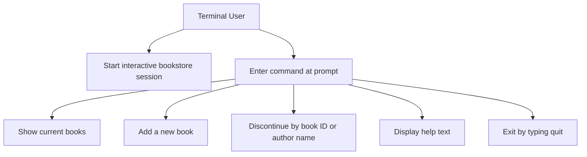
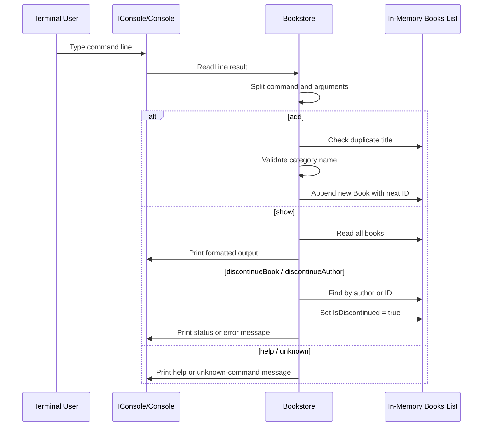

# Bookstore Application Documentation

This document describes the observable behavior of the Bookstore application, which is a .NET console application. It includes a description of the main personas and entities, a use case diagram, functional requirements, main binary commands and entry points, usage examples, and information lifecycle and data flow.

## 1. Personas and Entities

### Personas
- Terminal user: runs the executable, types commands at the prompt, and reads command output. This is the only clear human actor visible in code.
- System console: the runtime terminal input/output surface used for prompts, responses, and error output. It is wrapped partially through IConsole.cs and RealConsole.cs.

### Entities
- `IConsole`: abstraction for reading one line of input and writing formatted output. It defines `ReadLine`, `Write`, and two `WriteLine` overloads.
- `RealConsole`: concrete adapter that forwards `IConsole` calls to `System.Console`.
- Bookstore class: main application service and executable entry point. It owns the command loop, command parsing, in-memory catalog, and mutation logic.
- `Book`: in-memory domain model with `Id`, `Title`, `Author`, `CategoryId`, `Description`, and `IsDiscontinued`.
- `Books` collection: mutable in-memory list used as the only visible data store during process lifetime.
- `CategoryDictionary`: static category lookup declared in the main class. It is visible in code but not used by the add flow.
- `lastId`: in-memory counter used to assign sequential numeric IDs.

## 2. Use Case Diagram


## 3. Functional Requirements
- The application shall start an interactive command loop and display a `> ` prompt before each command.
- The application shall stop the loop when the user enters `quit`.
- The application shall parse the first token of each input line as the command name.
- The application shall support these command names:
  - `show`
  - `add`
  - `discontinueBook`
  - `discontinueAuthor`
  - `help`
- The application shall reject unknown commands and print an error message.

- The `add` flow shall attempt to create a book from four positional values after the command:
  - title
  - author
  - category
  - description
- The application shall reject duplicate titles by exact string comparison.
- The application shall map category names to numeric IDs only for these exact values:
  - `Fiction`
  - `Romance`
  - `Science Fiction`
  - `Fantasy`
  - `Mystery`
  - `Biography`
- The application shall reject a category if it does not match one of those exact strings and print `Invalid category` to standard error.
- The application shall assign a new sequential ID and mark new books as not discontinued.

- The discontinue flow shall choose behavior based on whether any existing book has an `Author` exactly equal to the supplied argument.
- If an exact author match exists, the application shall discontinue all non-discontinued books whose author matches case-insensitively after trimming.
- If no author match exists, the application shall treat the argument as a numeric book ID and attempt to discontinue that single book.
- When discontinuing by author, the application shall print a line for each newly discontinued book and print a not-found message if no active books match.
- When discontinuing by ID, no success message is printed.

- Error handling is centralized in the main loop. If command parsing or execution throws an exception, the application shall print `Error:` followed by the exception message to standard error and continue the loop.

### Observable implementation constraints
- The input model is space-splitting only. Titles, authors, categories, and descriptions containing spaces are not handled safely by the visible parser.
- Although `Science Fiction` is listed as a valid category, the visible `add` parser splits on spaces, so that category is not practically reachable through normal interactive input.
- The help text does not match the actual supported commands. It references `project`, `check`, and `uncheck`, which are not implemented in the visible command switch.
- The `show` method iterates the same book list twice, so each stored book is printed repeatedly rather than once.
- The console abstraction is only partial. Prompting and input use `IConsole`, but most output paths write directly to `System.Console`.

## 4. Main Binary Commands & Entry Points
- Main executable entry point: Program.cs
  - `Main(string[] args)` constructs `new Bookstore(new RealConsole()).Run()`.
  - No command-line arguments are consumed by the visible code.
- Runtime model: interactive console application
  - Confirmed by Bookstore.csproj, which sets `OutputType` to `Exe`.
- Framework target:
  - Bookstore.csproj targets `net10.0`.
- Runtime prerequisites visible in code:
  - A standard input/output console is required.
  - No environment variables, configuration keys, databases, web endpoints, scheduled jobs, or background workers are identifiable from the provided code.

## 5. Usage Examples
Start the application:

```bash
dotnet run --project Bookstore
```

Example interactive session using categories that fit the visible parser:

```text
> add Dune Herbert Fiction Classic
> add Foundation Asimov Fantasy Epic
> show
> discontinueBook 1
> discontinueAuthor Herbert
> help
> quit
```

Behavior notes for these examples:
- Each `add` command must provide exactly four space-separated values after `add`.
- Multi-word values are not reliably supported by the visible parser.
- `show` will currently print repeated rows because of the nested iteration in the implementation.

## 6. Information Lifecycle & Data Flow
- Data is created only in memory during the interactive session.
- A user enters a command line through the console abstraction.
- The Bookstore class splits the input into a command name and arguments.
- For `add`, the system validates title uniqueness, translates category text to a numeric ID, then appends a new `Book` object to the in-memory `Books` list.
- For `show`, the system reads from the in-memory list and writes formatted lines to the console.
- For discontinue operations, the system locates books in memory and flips `IsDiscontinued` to `true`.
- No persistent storage, export, serialization, or external integration is identifiable from the available code.
- All in-memory data is discarded when the process exits.



### Assumptions and Gaps
- No tests, persistence layer, or external documentation were provided, so long-term storage rules and intended business behavior are not identifiable from the available code.
- The scope request centered on IConsole.cs, so the analysis prioritizes that abstraction and only the immediate application flow that depends on it.
- Several behaviors appear inconsistent or incomplete in the current implementation, but this document reports them as observed code behavior rather than intended design.